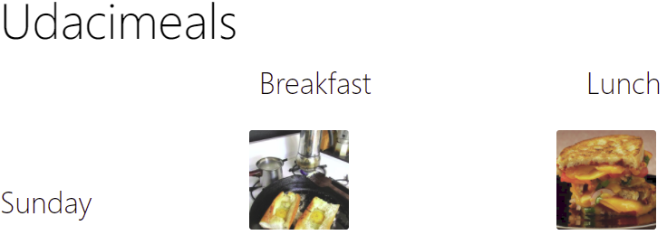

<html>

Installation instructions

<ul>
  <li>Download or clone the project directory</li>
  <li>Navigate to the project directory in your terminal</li>
  <li>run 'npm install'</li>
  <li>run 'npm run start'</li>
  <li>Navigate to localhost:3000 in your browser</li>
</ul>
</html>

